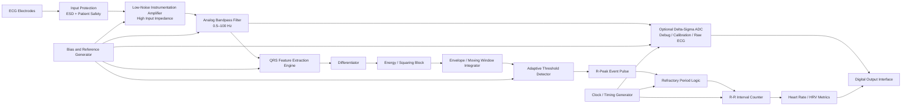

# Biosignal Foundry

## Ultra-Low-Power Event-Driven ECG Sensor SoC in GF180MCU

An analog-assisted cardiac feature extraction processor that directly extracts heartbeat timing information from ECG signals and outputs R-R intervals for heart-rate and heart-rate variability (HRV) monitoring.

---

## Overview

Traditional ECG systems continuously digitize the entire ECG waveform and perform signal processing digitally. While effective, this approach increases power consumption and data bandwidth requirements.

This project explores an alternative architecture in which critical cardiac features are extracted directly in hardware before digitization. Instead of transmitting the full ECG waveform, the chip detects heartbeats and outputs cardiac timing information, enabling ultra-low-power operation for wearable and implantable biomedical devices.

The project is being developed as part of the IEEE SSCS Chipathon 2026 using the GF180MCU open-source process.

---

## Key Features

- Ultra-low-power ECG acquisition
- Analog-assisted QRS feature extraction
- Real-time R-peak detection
- Event-driven signal processing
- Direct R-R interval measurement
- Heart rate and HRV estimation
- Minimal continuous ADC usage
- Designed for wearable and implantable applications

---

## Motivation

Many biomedical monitoring applications require only the timing of heartbeats rather than the complete ECG waveform.

Examples include:

- Heart rate monitoring
- Heart rate variability analysis
- Arrhythmia screening
- Long-term ambulatory monitoring
- Implantable sensing systems

By extracting cardiac timing information directly on-chip, significant reductions in power consumption, memory usage, and wireless transmission bandwidth can be achieved.

---
## System Architecture

Figure: Proposed event-driven ECG sensor SoC architecture. The chip extracts R-peak timing directly from the analog ECG signal and outputs R-R intervals, reducing the need for continuous full-waveform digitization.
## System Architecture

```text
ECG Electrodes
      │
      ▼
Instrumentation Amplifier
      │
      ▼
Bandpass Filter
      │
      ▼
QRS Feature Extraction Engine
(Differentiator + Energy Extraction)
      │
      ▼
Adaptive Threshold Detector
      │
      ▼
R-Peak Events
      │
      ▼
R-R Interval Measurement
      │
      ▼
Heart Rate / HRV Metrics
```

Optional waveform capture path:

```text
Filtered ECG
      │
      ▼
Delta-Sigma ADC
      │
      ▼
Raw ECG Data
```

---

## Target Specifications

| Parameter | Target |
|------------|----------|
| Process | GF180MCU |
| Supply Voltage | 1.8–3.3 V |
| ECG Bandwidth | 0.5–100 Hz |
| Heart Rate Range | 30–220 BPM |
| Detection Accuracy | >95% |
| Power Consumption | <100 µW |
| Output | R-R Intervals |
| Application | Wearable & Implantable Sensing |

---

## Major Building Blocks

### Analog Front-End (AFE)

- ECG instrumentation amplifier
- High input impedance
- Low-noise signal acquisition
- Baseline wander suppression
- Motion artifact rejection

### QRS Feature Extraction Engine

- Analog differentiation
- Energy extraction
- Envelope generation
- Feature enhancement

### Adaptive Threshold Detector

- Dynamic threshold generation
- R-peak identification
- Refractory period implementation

### Timing Engine

- Event-based heartbeat measurement
- R-R interval extraction
- Heart rate computation

### Optional ADC

- Delta-Sigma architecture
- Calibration and debugging support
- Periodic waveform capture

---

## Verification Plan

### Algorithm-Level Verification

- MIT-BIH Arrhythmia Database
- Python reference implementation
- Detection accuracy evaluation

### Circuit-Level Verification

- AC analysis
- Noise analysis
- Transient simulations
- Corner simulations
- Monte Carlo simulations

### Post-Layout Verification

- PEX extraction
- Post-layout transient analysis
- Power estimation

---

## Applications

- Wearable health monitors
- Long-term ambulatory ECG
- Implantable medical devices
- Battery-powered biosensors
- Remote patient monitoring
- Future closed-loop biomedical systems

---

## Team

### Team Name
**Biosignal Foundry**

### Team Members

- Surya Varchasvi Devaraj (Team Lead)
- Wenxin Zeng
- Yutong Wu
- Leah Berube
- Fayruj Fathima

---

## Chipathon 2026

This project is being developed as part of the IEEE Solid-State Circuits Society (SSCS) Chipathon 2026.

Track B – Circuits for Sensors

---

## Repository Status

- [x] Project definition
- [ ] Architecture freeze
- [ ] AFE design
- [ ] QRS engine design
- [ ] Timing engine design
- [ ] ADC evaluation
- [ ] Layout
- [ ] Post-layout verification
- [ ] Final tapeout submission

---
## Repository Structure

```text
biosignal-foundry-ecg-soc/
│
├── README.md
│
├── docs/
│   ├── architecture.md
│   ├── specifications.md
│   ├── block_diagrams/
│   ├── meeting_notes/
│   └── references/
│
├── system/
│   ├── requirements.md
│   ├── signal_chain.md
│   └── power_budget.xlsx
│
├── analog/
│   ├── afe/
│   │   ├── instrumentation_amplifier/
│   │   ├── input_protection/
│   │   └── biasing/
│   │
│   ├── filters/
│   │   ├── highpass/
│   │   ├── lowpass/
│   │   └── notch/
│   │
│   ├── qrs_detector/
│   │   ├── differentiator/
│   │   ├── energy_extractor/
│   │   ├── envelope_detector/
│   │   └── threshold_detector/
│   │
│   ├── comparator/
│   ├── biasing/
│   └── adc/
│       └── delta_sigma/
│
├── digital/
│   ├── rr_counter/
│   ├── hrv_engine/
│   ├── state_machine/
│   └── rtl/
│
├── simulations/
│   ├── ecg_datasets/
│   │   └── mit_bih/
│   │
│   ├── python/
│   │   ├── algorithm_model/
│   │   ├── validation/
│   │   └── plotting/
│   │
│   └── testbenches/
│
├── layout/
│   ├── floorplan/
│   ├── blocks/
│   └── final_chip/
│
├── verification/
│   ├── ac_analysis/
│   ├── transient_analysis/
│   ├── noise_analysis/
│   ├── corner_sims/
│   ├── monte_carlo/
│   └── postlayout/
│
├── tapeout/
│   ├── gds/
│   ├── reports/
│   └── final_submission/
│
└── images/
    ├── architecture/
    ├── simulation_results/
    └── layout_snapshots/
```
## Work Breakdown

| Block | Owner | Status |
|---------|---------|---------|
| System Architecture | Surya | In Progress |
| ECG Front-End | TBD | Planned |
| Filters | TBD | Planned |
| QRS Feature Extraction Engine | TBD | Planned |
| Threshold Detector | TBD | Planned |
| R-R Interval Measurement | TBD | Planned |
| Delta-Sigma ADC | TBD | Planned |
| Python Reference Model | TBD | Planned |
| Layout | TBD | Planned |
| Verification | TBD | Planned |

## License

Apache 2.0 License
