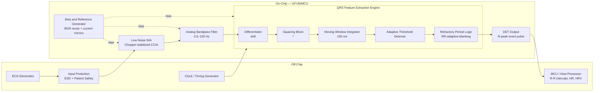

# Biosignal Foundry

## Ultra-Low-Power Event-Driven ECG Sensor SoC in GF180MCU

An analog-assisted cardiac feature extraction processor that directly detects R-peaks from ECG signals and outputs a digital event pulse per heartbeat, enabling heart-rate and heart-rate variability (HRV) monitoring with minimal on-chip digital complexity.

---

## Overview

Traditional ECG systems continuously digitize the entire ECG waveform and perform signal processing digitally. While effective, this approach increases power consumption and data bandwidth requirements.

This project explores an alternative architecture in which critical cardiac features are extracted directly in the analog domain before any digitization. Instead of transmitting a full ECG waveform, the chip detects each heartbeat and outputs a single digital pulse (DET) per R-peak. An off-chip MCU timestamps these pulses using a hardware timer, computes R-R intervals, and derives heart rate and HRV metrics in firmware — keeping the on-chip design focused, low-power, and tapeout-feasible.

The project is being developed as part of the IEEE SSCS Chipathon 2026 using the GF180MCU open-source 180 nm process.

---

## Key Features

- Ultra-low-power ECG acquisition via chopper-stabilized CCIA front-end
- Fully analog Pan-Tompkins QRS feature extraction engine
- Single DET pulse output per R-peak — MCU computes timing metrics
- Event-driven architecture: no continuous ADC on the critical path
- Target power < 50 µW total on-chip
- Designed for wearable and implantable applications
- Implemented in GF180MCU 180 nm, targeting Chipathon Block B (500 µm × 1100 µm)

---

## Motivation

Many biomedical monitoring applications require only the timing of heartbeats rather than the complete ECG waveform. Examples include:

- Heart rate monitoring
- Heart rate variability (HRV) analysis
- Arrhythmia screening
- Long-term ambulatory monitoring
- Implantable sensing systems

By extracting cardiac timing information directly on-chip in the analog domain and offloading computation to an MCU, significant reductions in on-chip power, complexity, and tapeout risk are achieved — while retaining full clinical utility of the cardiac timing data.

---

## System Architecture



> The chip outputs one digital pulse per detected R-peak on the DET pin. The MCU measures inter-pulse intervals to compute R-R intervals, heart rate, and HRV — no on-chip counter or digital back-end required.

---

## Target Specifications

| Parameter | Target | Notes |
|---|---|---|
| Process | GF180MCU 180 nm | Open-source PDK |
| Die block | Block B — 500 µm × 1100 µm | 16 available pins |
| Supply voltage | 3.3 V analog | |
| ECG bandwidth | 0.5–150 Hz | |
| Heart rate range | 30–220 BPM | |
| R-peak detection accuracy | > 95% | Pan-Tompkins analog |
| Total on-chip power | < 50 µW | |
| INA gain | 40 dB | |
| INA noise | < 200 nV/√Hz | |
| INA CMRR | > 90 dB | |
| INA input impedance | > 100 MΩ | Chopper-stabilized |
| Chopper frequency | 19.2 kHz | = CLK/4 |
| Signal pins | 6 | INP, INN, VREF, VBIAS, CLK, DET |
| Output | DET pulse per R-peak | R-R timing done off-chip |
| Application | Wearable and implantable cardiac sensing | |

---

## On-Chip Block Summary

| Block | Area (est.) | Status | Owner |
|---|---|---|---|
| CCIA / INA front-end | ~0.18 mm² | In design | Leah |
| QRS analog engine | ~0.12 mm² | In design | Yutong |
| OTA family (5T + cascode variant) | ~0.04 mm² | Reuse + adapt | Wenxin |
| Bias cell + current mirrors | ~0.02 mm² | In design | Fayruj |
| Bandgap reference (BGR) | ~0.03 mm² | Reuse (IIC-OSic) | Fayruj |
| I/O ring (6 signal pins) | ~0.04 mm² | Block B pad frame | Surya |
| Top-level integration + testbench | — | In progress | Surya |
| **Total** | **~0.43 mm²** | | |
| Block B capacity | 0.55 mm² | ~0.12 mm² margin | |

> **ADC:** The on-chip ΔΣ ADC has been descoped from this revision. Raw ECG waveform capture is deferred to a future revision or can be performed off-chip. This decision directly addresses reviewer feedback on feasibility and scope.

---

## Pin Assignment

| Pin | Direction | Type | Function |
|---|---|---|---|
| INP | In | Analog | ECG differential input (+) |
| INN | In | Analog | ECG differential input (−) |
| VREF | In | Analog | Voltage reference input |
| VBIAS | In | Analog | Bias trim input |
| CLK | In | Digital | Off-chip clock input |
| DET | Out | Digital | R-peak event pulse (one per heartbeat) |

Supply rails (VDD, GND) are provided by the Chipathon shared power infrastructure and are not counted as signal pins.

---

## Work Distribution

| Person | Role | Owns |
|---|---|---|
| Surya Varchasvi Devaraj | Team lead, integration | Top-level netlist, testbench, I/O ring, system architecture |
| Wenxin Zeng | OTA design | 5T OTA (reuse + adapt), cascode variant for CCIA |
| Yutong Wu | QRS engine | OTA-C BPF, differentiator, squaring cell, MWI, threshold comparators, refractory timer, DET pulse conditioner |
| Leah Berube | CCIA / INA | Chopper switches, feedback cap array, DC servo loop, impedance boost, CMFB |
| Fayruj Fathima | Bias and reference | Beta-multiplier bias cell, current mirror array, BGR instantiation, VREF divider |

---

## Design Decisions Log

| Decision | Rationale |
|---|---|
| ADC removed from on-chip scope | Reviewer consensus: reuse or take off-chip. Reduces area by ~0.19 mm² and eliminates highest-complexity block. |
| R-R counter and digital back-end removed | MCU handles timing trivially via input-capture GPIO. Simplifies chip to pure analog + one digital output pin. |
| BGR reused from IIC-OSic reference cell | Reviewer suggestion: reuse existing cells. Saves ~1 week of design time for Person 1. |
| OTA topology reused from agurlask/sample-ota_gf180mcuD | 5-transistor PMOS-input OTA in GF180MCU. Cascode load variant designed for CCIA (≥ 60 dB gain). |
| Clock remains off-chip | Removes ring oscillator / FLL design risk. Off-chip crystal provides CLK. |
| DRL circuit off-chip | Standard in ECG front-end PCB. Not required on-chip for Chipathon demonstration. |
| Block B selected (500 µm × 1100 µm) | Revised area ~0.43 mm² fits with ~0.12 mm² margin. 6 signal pins within 16-pin allocation. |
| EWMA threshold update off-chip | Adaptive threshold time constants remain an open item; initial implementation uses fixed thresholds on-chip with EWMA deferred to MCU firmware. |

---

## Major Building Blocks

### Low-Noise Instrumentation Amplifier (CCIA)

- Chopper-stabilized capacitively-coupled instrumentation amplifier
- 2-stage fully differential OTA, DC gain 60–80 dB, GBW 1 MHz
- Chopper frequency 19.2 kHz (= CLK/4, lands on decimation null)
- DC servo loop for baseline wander rejection
- Impedance boost loop, input impedance > 100 MΩ
- CMFB, output CM = 1.65 V
- Gain: 40 dB | Noise: < 200 nV/√Hz | CMRR: > 90 dB

### Analog Bandpass Filter

- OTA-C topology, 0.5–100 Hz passband
- Reuses OTA cell from the shared OTA family

### QRS Feature Extraction Engine

- **Differentiator:** OTA-C, ~30 ms time constant, highlights QRS slope
- **Squaring block:** Gilbert-type or MOSFET-in-saturation, produces V² output
- **Moving window integrator:** OTA + ~15 pF cap, 150 ms window
- **Adaptive threshold detector:** Dual comparator with EWMA-updated thresholds
- **Refractory period logic:** RR-adaptive blanking window, supports 30–220 BPM

### Bias and Reference Generator

- Current reference: self-biased beta-multiplier
- Bandgap reference: reused IIC-OSic GF180MCU BGR cell (Banba-type)
- VREF = 1.65 V via resistor divider
- PMOS/NMOS mirror array distributes IBIAS to all blocks

### OTA Family

- Base cell: 5-transistor PMOS-input OTA (adapted from agurlask/sample-ota_gf180mcuD)
- Devices: `pfet_03v3` input pair, `nfet_03v3` mirror load, `pfet_03v3` tail
- Cascode load variant for CCIA: adds `nfet_03v3` cascode pair, achieves ≥ 60 dB DC gain
- Two sizing variants: CCIA (GBW 1 MHz, Itail ~30 µA) and QRS/filter (GBW 50–100 kHz, Itail ~5 µA)

---

## Verification Plan

### Algorithm-Level Verification

- MIT-BIH Arrhythmia Database
- Python reference implementation of analog Pan-Tompkins chain
- Detection accuracy evaluation (target > 95%)

### Circuit-Level Verification

- AC analysis: gain, bandwidth, CMRR, PSRR per block
- Noise analysis: input-referred noise, noise floor
- Transient simulations with synthetic ECG stimulus (60–120 BPM)
- Corner simulations (TT, FF, SS, FS, SF)
- Monte Carlo simulations for mismatch sensitivity

### Post-Layout Verification

- Parasitic extraction (PEX)
- Post-layout transient analysis
- Power estimation

---

## Key Schedule Milestones

| Date | Milestone |
|---|---|
| July 3, 2026 | Schematic review — all blocks must have schematics and preliminary simulation |
| July 10, 2026 | Block-level simulation review |
| July 17, 2026 | Top-level simulation + go/no-go gate |
| July 31, 2026 | DRC dry-run |
| August 14, 2026 | Block layout review |
| August 21, 2026 | Top-level layout review + DRC dry-run |
| August 28, 2026 | Final chip review and GDS submission |

---

## Repository Structure

```text
biosignal-foundry-ecg-soc/
│
├── README.md
│
├── docs/
│   ├── architecture.md
│   ├── specifications.md
│   ├── design_decisions.md
│   ├── block_diagrams/
│   ├── meeting_notes/
│   └── references/
│
├── system/
│   ├── requirements.md
│   ├── signal_chain.md
│   └── power_budget.xlsx
│
├── analog/
│   ├── afe/
│   │   ├── instrumentation_amplifier/
│   │   ├── input_protection/
│   │   └── biasing/
│   │
│   ├── filters/
│   │   ├── bandpass/
│   │   └── highpass/
│   │
│   ├── qrs_detector/
│   │   ├── differentiator/
│   │   ├── squaring_block/
│   │   ├── moving_window_integrator/
│   │   ├── threshold_detector/
│   │   └── refractory_timer/
│   │
│   ├── ota/
│   │   ├── ota_5t_base/
│   │   └── ota_cascode/
│   │
│   └── biasing/
│       ├── bias_cell/
│       └── bgr/
│
├── simulations/
│   ├── ecg_datasets/
│   │   └── mit_bih/
│   │
│   ├── python/
│   │   ├── algorithm_model/
│   │   ├── validation/
│   │   └── plotting/
│   │
│   └── testbenches/
│       ├── tb_ota/
│       ├── tb_ccia/
│       ├── tb_bpf/
│       ├── tb_qrs_engine/
│       └── tb_toplevel/
│
├── layout/
│   ├── floorplan/
│   ├── blocks/
│   └── final_chip/
│
├── verification/
│   ├── ac_analysis/
│   ├── transient_analysis/
│   ├── noise_analysis/
│   ├── corner_sims/
│   ├── monte_carlo/
│   └── postlayout/
│
├── tapeout/
│   ├── gds/
│   ├── reports/
│   └── final_submission/
│
└── images/
    ├── architecture/
    ├── simulation_results/
    └── layout_snapshots/
```

---

## Repository Status

- [x] Project definition
- [x] Architecture freeze
- [x] Design decisions documented
- [ ] OTA characterization (Wenxin)
- [ ] CCIA / INA schematic (Leah)
- [ ] QRS engine schematic (Yutong)
- [ ] Bias cell + BGR (Fayruj)
- [ ] Top-level integration (Surya)
- [ ] Block-level simulations
- [ ] Top-level system simulation
- [ ] Layout
- [ ] Post-layout verification
- [ ] Final tapeout submission

---

## Chipathon 2026

This project is developed as part of the IEEE Solid-State Circuits Society (SSCS) Chipathon 2026, Track B — Circuits for Sensors.

- Die block: Block B (500 µm × 1100 µm, 16 pins)
- Process: GF180MCU (GlobalFoundries 180 nm open-source PDK)
- Tools: Xschem, ngspice, KLayout, iic-osic-tools Docker environment

---

## Team

**Biosignal Foundry**

| Name | Role |
|---|---|
| Surya Varchasvi Devaraj | Team Lead, System Architecture, Integration |
| Wenxin Zeng | CCIA / Instrumentation Amplifier |
| Leah Berube | OTA Design |
| Fayruj Fathima | QRS Feature Extraction Engine |
| Yutong Wu | Bias and Reference Generation |

---

## License

Apache 2.0 License
