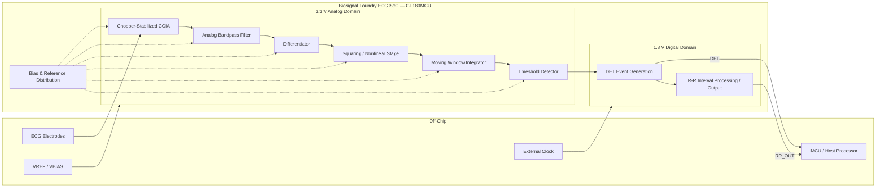

# Biosignal Foundry

## Ultra-Low-Power Event-Driven ECG Sensor SoC with Analog R-Peak Detection

**IEEE SSCS Chipathon 2026 — Team B08**
**Track B — Circuits for Sensors**
**Technology: GlobalFoundries GF180MCU 180 nm**

---

## Project Overview

**Biosignal Foundry** is developing an ultra-low-power, event-driven ECG sensor SoC that directly extracts cardiac timing information from ECG signals using an analog signal-processing chain.

Conventional ECG systems continuously amplify, digitize, and process the complete ECG waveform. Although this approach provides full waveform information, a continuously operating ADC and digital signal-processing backend increase:

* Power consumption
* Silicon area
* Digital switching activity
* Data bandwidth
* Memory requirements
* System complexity

Our architecture instead performs the critical **QRS feature extraction and R-peak detection operations directly in the analog domain**.

The chip processes the ECG waveform through a low-noise analog front end and analog QRS-detection chain and generates a digital **DET pulse for each detected heartbeat**.

The current architecture additionally exposes an **RR_OUT** interface for R-R interval data.

The design is implemented in the **GlobalFoundries GF180MCU 180 nm open-source CMOS process** as part of the **IEEE Solid-State Circuits Society Chipathon 2026**.

---

# Project Resources

The following resources document the design, simulations, project progress, and original Chipathon proposal.

## Schematic & Simulation Results

[**Schematic and Simulations — Google Slides**](https://docs.google.com/presentation/d/18qcQKhdBwNA_3tAG34yTULziVt0hrGmls-qpCYDhvls/edit?usp=sharing)

Contains:

* Circuit schematics
* Block-level simulations
* Top-level simulations
* Design evolution
* Simulation results
* Design review material

---

## Project Progress Tracker

[**B08 Chipathon Progress Tracker — Google Sheets**](https://docs.google.com/spreadsheets/d/1Dva5xNq5iXcITRApbbd2DMtIVU4WqZdsdKf1LQmGMNk/edit?usp=sharing)

Used to track:

* Circuit ownership
* Schematic progress
* Simulation progress
* Layout progress
* Verification status
* Project milestones

---

## Pin Assignment / Chip Interface

[**Chipathon Pin Assignment — Google Sheets**](https://docs.google.com/spreadsheets/d/1QQbtaFOqn0G63YKYgDVndsNMXKOrIu-xAYuyjMj1dco/edit?gid=0#gid=0)

Defines the current analog, digital, power, clock, and output pin requirements for the design.

---

## IEEE SSCS Chipathon Project Issue

[**Team B08 Biosignal Foundry — Chipathon Issue #63**](https://github.com/sscs-ose/sscs-chipathon-2026/issues/63)

Contains the original:

* Project registration
* Team information
* Initial system architecture
* Proposed specifications
* Original project scope
* Chipathon proposal

> **Note:** The architecture in the original proposal represents the initial design concept. The architecture documented in this README reflects the latest implementation following schematic design, simulation, integration, and physical layout.

---

# Current Project Status

The project has completed schematic design, simulation, integration, and physical layout.

The design is currently undergoing **Layout Versus Schematic verification (LVS)**.

| Development Stage                | Status             |
| -------------------------------- | ------------------ |
| Project definition               | ✅ Complete         |
| Architecture definition          | ✅ Complete         |
| Architecture freeze              | ✅ Complete         |
| Circuit specifications           | ✅ Complete         |
| OTA design                       | ✅ Complete         |
| CCIA / instrumentation amplifier | ✅ Complete         |
| Analog filtering                 | ✅ Complete         |
| QRS feature-extraction chain     | ✅ Complete         |
| Threshold detector               | ✅ Complete         |
| Bias and reference circuitry     | ✅ Complete         |
| Block-level schematics           | ✅ Complete         |
| Block-level simulations          | ✅ Complete         |
| Top-level schematic integration  | ✅ Complete         |
| Top-level simulations            | ✅ Complete         |
| Block-level layout               | ✅ Complete         |
| Top-level physical layout        | ✅ Complete         |
| LVS                              | 🔄 **In Progress** |
| Parasitic extraction             | ⬜ Pending          |
| Post-layout simulations          | ⬜ Pending          |
| Final verification               | ⬜ Pending          |
| Final GDS preparation            | ⬜ Pending          |
| Tapeout submission               | ⬜ Pending          |

### Current Milestone

> **All schematics, pre-layout simulations, top-level integration, and physical layout have been completed. The design is currently undergoing LVS verification.**

---

# 1. Motivation

Continuous physiological monitoring places stringent requirements on:

* Power consumption
* Silicon area
* Signal quality
* Data bandwidth
* Battery life
* Computational complexity

A conventional ECG signal-processing system typically follows:

```text
ECG Electrodes
      ↓
Instrumentation Amplifier
      ↓
Analog Filter
      ↓
ADC
      ↓
Digital Signal Processor
      ↓
QRS Detection
      ↓
Heart Rate / HRV
```

This architecture is powerful because the complete ECG waveform remains available.

However, many ultra-low-power biomedical applications primarily require **cardiac timing information** instead of continuous access to the full ECG waveform.

Examples include:

* Continuous heart-rate monitoring
* Heart-rate-variability analysis
* Long-term ambulatory monitoring
* Physiological stress monitoring
* Implantable sensing
* Wearable cardiac monitoring
* Activity-associated heart-rate monitoring
* Event-driven biomedical sensing

For such applications, continuously digitizing the complete ECG waveform may consume unnecessary power and communication bandwidth.

The objective of Biosignal Foundry is therefore to move the critical cardiac feature-extraction operations into the **analog domain before conventional continuous digitization**.

---

# 2. Core Concept

The fundamental architecture is:

```text
ECG
 ↓
Analog Acquisition
 ↓
Analog Signal Conditioning
 ↓
Analog QRS Feature Extraction
 ↓
R-Peak Detection
 ↓
Digital Cardiac Event
```

Instead of generating a continuous digital ECG data stream, the system provides an event corresponding to a detected heartbeat.

The primary event output is:

```text
DET
```

where ideally:

```text
1 QRS Complex
      ↓
1 R-Peak Detection
      ↓
1 DET Pulse
```

The current chip interface also provides:

```text
RR_OUT
```

for R-R interval data output.

---

# 3. High-Level System Architecture



---

# 4. Implemented Signal Chain

The primary ECG-processing path is:

```text
INP / INN
    ↓
Chopper-Stabilized CCIA
    ↓
Analog Bandpass Filter
    ↓
Differentiator
    ↓
Squaring / Nonlinear Stage
    ↓
Moving Window Integrator
    ↓
Threshold Detector
    ↓
R-Peak Event Detection
    ↓
    ├─────────────► DET
    │
    └─────────────► R-R Processing
                         ↓
                      RR_OUT
```

The analog QRS-processing architecture is inspired by the fundamental operations used in Pan-Tompkins-type QRS detection.

---

# 5. Chopper-Stabilized ECG Front End

The first major block is the ECG instrumentation amplifier.

A **chopper-stabilized capacitively coupled instrumentation amplifier (CCIA)** is used to amplify the low-amplitude ECG signal while reducing the influence of low-frequency amplifier noise.

The front end is intended to provide:

* High differential gain
* High common-mode rejection
* High input impedance
* Low input-referred noise
* Low-frequency flicker-noise suppression
* Baseline and DC offset rejection
* Controlled output common-mode voltage
* Compatibility with subsequent analog filtering stages

## Target Front-End Specifications

| Parameter            |      Target |
| -------------------- | ----------: |
| Analog supply        |       3.3 V |
| Voltage gain         |      ~40 dB |
| Input impedance      |     >100 MΩ |
| CMRR                 |      >90 dB |
| Input-referred noise | <200 nV/√Hz |
| Chopper frequency    |   ~19.2 kHz |

### Status

**Schematic:** ✅ Complete
**Simulation:** ✅ Complete
**Layout:** ✅ Complete

---

# 6. Analog Bandpass Filter

Following amplification, the ECG signal passes through an integrated analog filtering stage.

The filter is intended to suppress:

* Electrode DC offsets
* Baseline wander
* Very-low-frequency motion artifacts
* High-frequency interference
* Out-of-band noise

The target ECG bandwidth is approximately:

```text
0.5 Hz – 150 Hz
```

The QRS-processing path further emphasizes the frequency components most useful for R-peak detection.

OTA-based implementations are used where appropriate to enable low-frequency integrated filtering.

### Status

**Schematic:** ✅ Complete
**Simulation:** ✅ Complete
**Layout:** ✅ Complete

---

# 7. Analog QRS Feature-Extraction Engine

The principal signal-processing component of the project is the analog QRS feature-extraction chain.

Rather than digitizing the complete ECG waveform before QRS processing, several signal-processing operations are performed directly using analog circuits.

The primary stages are:

1. Differentiation
2. Nonlinear / squaring operation
3. Moving-window integration
4. Threshold detection
5. Event generation

---

## 7.1 Differentiator

The differentiator emphasizes rapid changes in the ECG waveform.

The QRS complex generally has a significantly greater slope than the slower P- and T-wave components.

Conceptually:

```text
Vdiff ∝ dVECG / dt
```

The differentiator therefore increases the contrast between the QRS complex and slower ECG components.

### Status

**Schematic:** ✅ Complete
**Simulation:** ✅ Complete
**Layout:** ✅ Complete

---

## 7.2 Squaring / Nonlinear Stage

The differentiated waveform is passed through a nonlinear stage.

This operation:

* Reduces polarity dependence
* Emphasizes high-slope signal components
* Suppresses small background variations
* Increases QRS-to-background contrast

Conceptually:

```text
Vsquare ∝ Vdiff²
```

or an equivalent transistor-domain nonlinear approximation.

### Status

**Schematic:** ✅ Complete
**Simulation:** ✅ Complete
**Layout:** ✅ Complete

---

## 7.3 Moving Window Integrator

The nonlinear waveform is subsequently integrated over a finite time window.

This provides information related to both:

* QRS energy
* QRS duration

The integration window is selected to correspond approximately to the temporal duration of the QRS complex.

A nominal range is:

```text
~80 – 150 ms
```

depending on the final circuit implementation.

### Status

**Schematic:** ✅ Complete
**Simulation:** ✅ Complete
**Layout:** ✅ Complete

---

## 7.4 Threshold Detection

The integrated waveform is compared against a detection threshold.

When the processed signal exceeds the threshold, the circuit identifies a candidate heartbeat event.

The threshold stage therefore converts an analog feature waveform into an event representation.

### Status

**Schematic:** ✅ Complete
**Simulation:** ✅ Complete
**Layout:** ✅ Complete

---

## 7.5 Event and Pulse Generation

Following threshold detection, event-conditioning circuitry produces the digital heartbeat event.

The intended relationship is:

```text
Processed ECG
     ↓
Threshold Crossing
     ↓
R-Peak Detection
     ↓
DET Pulse
```

The goal is:

```text
1 detected heartbeat → 1 DET pulse
```

---

# 8. DET Event Output

The primary event-driven output is:

```text
DET
```

`DET` provides a digital pulse corresponding to an R-peak detection.

This output allows external hardware to directly observe heartbeat events without requiring continuous access to the internal analog ECG waveform.

Possible external uses include:

* Heartbeat timestamping
* Heart-rate calculation
* HRV analysis
* Event logging
* External validation
* Wireless transmission

---

# 9. R-R Interval Output

The current interface additionally contains:

```text
RR_OUT
```

`RR_OUT` provides R-R interval data from the cardiac timing path.

Conceptually:

```text
R-Peak Events
      ↓
Timing Measurement
      ↓
R-R Interval
      ↓
RR_OUT
```

Providing both `DET` and `RR_OUT` allows access to:

* Immediate heartbeat events
* Beat-to-beat interval information

---

# 10. Evolution from the Original Proposal

The architecture evolved during the Chipathon design process.

The original proposal considered a broader architecture incorporating additional waveform-digitization and digital-processing functionality.

During circuit development, the project was focused toward the primary research objective:

> **Ultra-low-power analog ECG feature extraction with event-driven cardiac detection.**

The current architecture therefore emphasizes:

```text
Analog ECG Acquisition
        +
Analog Filtering
        +
Analog QRS Processing
        +
R-Peak Detection
        +
DET / RR_OUT
```

This reduces unnecessary circuit complexity while retaining the primary physiological timing information required for cardiac monitoring.

---

# 11. ADC Design Decision

An ADC was considered during the early architecture phase.

A continuously operating ADC was subsequently removed from the critical signal path for the current revision.

The decision reduces:

* Silicon area
* Power consumption
* Integration complexity
* Verification complexity
* Tapeout risk

The present design therefore focuses primarily on **analog feature extraction and event generation**.

Raw ECG waveform acquisition can be performed externally during characterization or incorporated into a future version of the SoC.

---

# 12. OTA Building Blocks

Operational transconductance amplifiers form important building blocks throughout the analog signal-processing chain.

Applications include:

* Front-end amplification
* Filtering
* Differentiation
* Integration
* Bias support
* Threshold-related analog circuitry

OTA design requires tradeoffs between:

* DC gain
* Transconductance
* Bandwidth
* Stability
* Noise
* Output swing
* Power consumption
* Silicon area

Reusable OTA structures were employed where possible to reduce design complexity and improve consistency across the system.

### Status

**Design:** ✅ Complete
**Simulation:** ✅ Complete
**Layout:** ✅ Complete

---

# 13. Bias and Reference Generation

The analog circuitry requires stable bias currents and voltage references.

The bias and reference subsystem supports:

* CCIA biasing
* OTA bias currents
* Filter operation
* QRS-processing circuitry
* Comparator operation
* Analog references

External pins are also provided for:

```text
VREF
VBIAS
```

to provide reference and bias-trim capability during operation and characterization.

### Status

**Schematic:** ✅ Complete
**Simulation:** ✅ Complete
**Layout:** ✅ Complete

---

# 14. Technology

The design is implemented using:

## GlobalFoundries GF180MCU

| Parameter             | Value                    |
| --------------------- | ------------------------ |
| Technology            | GF180MCU                 |
| Nominal process node  | 180 nm                   |
| Design type           | Mixed-signal CMOS        |
| Analog supply         | 3.3 V                    |
| Digital supply        | 1.8 V                    |
| Development ecosystem | Open-source              |
| Program               | IEEE SSCS Chipathon 2026 |

---

# 15. Chipathon Block

The design targets:

**IEEE SSCS Chipathon 2026 — Block B**

Approximate available block dimensions:

```text
250 µm × 280 µm
```

The architecture has been designed to fit within the available Chipathon area and interface constraints.

---

# 16. Target Specifications

| Parameter                  |                         Target |
| -------------------------- | -----------------------------: |
| Process                    |                GF180MCU 180 nm |
| Chipathon Track            | Track B — Circuits for Sensors |
| Chipathon Team             |        B08 — Biosignal Foundry |
| Block                      |                        Block B |
| Approximate block size     |               500 µm × 1100 µm |
| Analog supply              |                          3.3 V |
| Digital supply             |                          1.8 V |
| ECG bandwidth              |                    ~0.5–150 Hz |
| Heart-rate range           |                    ~30–220 BPM |
| Front-end gain             |                         ~40 dB |
| CMRR                       |                         >90 dB |
| Input impedance            |                        >100 MΩ |
| Chopper frequency          |                      ~19.2 kHz |
| R-peak detection target    |                           >95% |
| Target total on-chip power |                         <50 µW |
| Primary event output       |                            DET |
| R-R interval output        |                         RR_OUT |
| Continuous ADC             |                       Not used |
| Total external pins        |                             11 |

---

# 17. Chip Interface and Pin Requirements

The current SoC requires **11 external connections**.

These include:

* Two ECG inputs
* Two analog reference/bias inputs
* Analog power and ground
* Digital power and ground
* One digital clock input
* Two digital outputs

## Pin Assignment

| Pin Name   | Direction | Type    | Description                     |
| ---------- | --------- | ------- | ------------------------------- |
| **INP**    | Input     | Analog  | ECG differential input pair     |
| **INN**    | Input     | Analog  | ECG differential input pair     |
| **VREF**   | Input     | Analog  | Reference voltage and bias trim |
| **VBIAS**  | Input     | Analog  | Reference voltage and bias trim |
| **VDD_A**  | Supply    | Power   | Analog supply — 3.3 V           |
| **GND_A**  | Supply    | Power   | Analog ground                   |
| **VDD_D**  | Supply    | Power   | Digital supply — 1.8 V          |
| **GND_D**  | Supply    | Power   | Digital ground                  |
| **CLK**    | Input     | Digital | Off-chip clock                  |
| **DET**    | Output    | Digital | R-peak event pulse              |
| **RR_OUT** | Output    | Digital | R-R interval data output        |

---

## Pin Count Summary

| Category          | Pins         |  Count |
| ----------------- | ------------ | -----: |
| ECG inputs        | INP, INN     |      2 |
| Analog references | VREF, VBIAS  |      2 |
| Analog power      | VDD_A, GND_A |      2 |
| Digital power     | VDD_D, GND_D |      2 |
| Digital input     | CLK          |      1 |
| Digital outputs   | DET, RR_OUT  |      2 |
| **Total**         |              | **11** |

---

# 18. External Interface Diagram

```text
                    ┌────────────────────────────────┐
                    │                                │
        INP  ──────►│                                │
        INN  ──────►│                                │
                    │                                │
       VREF  ──────►│                                │
      VBIAS  ──────►│                                │
                    │                                │
      VDD_A  ──────►│       BIOSIGNAL FOUNDRY       │
      GND_A  ──────►│          ECG SoC               │
                    │                                │
                    │          GF180MCU               │
      VDD_D  ──────►│                                │
      GND_D  ──────►│                                │
                    │                                │
        CLK  ──────►│                                │
                    │                                │
                    │                         DET ────►
                    │                                │
                    │                      RR_OUT ────►
                    │                                │
                    └────────────────────────────────┘
```

---

# 19. Analog Supply Domain

The analog signal-processing circuitry operates from:

```text
VDD_A = 3.3 V
GND_A = Analog Ground
```

The analog domain primarily supports:

* Chopper-stabilized CCIA
* Analog filters
* OTAs
* Differentiator
* Nonlinear processing
* Moving-window integration
* Analog threshold circuitry
* Bias and reference circuitry

Separating the analog and digital supplies helps reduce digital switching noise coupling into the sensitive ECG signal path.

---

# 20. Digital Supply Domain

The digital circuitry operates from:

```text
VDD_D = 1.8 V
GND_D = Digital Ground
```

The digital domain supports the digital/timing-related portions of the system, including:

* Clock-related circuitry
* DET event generation
* R-R timing/output circuitry
* Digital output stages

---

# 21. ECG Input Interface

The differential ECG input is provided through:

```text
INP
INN
```

These inputs connect to the chopper-stabilized instrumentation amplifier.

A differential architecture improves rejection of common-mode interference, which is especially important for low-amplitude biopotential signals.

---

# 22. Reference and Bias Interface

Two externally accessible analog control pins are provided:

```text
VREF
VBIAS
```

These provide reference and bias-trim capability for the analog circuitry.

External accessibility is useful for:

* Initial silicon characterization
* Bias optimization
* Operating-point adjustment
* Testing
* Debugging

---

# 23. Clock Interface

The system uses an external clock:

```text
CLK
```

The clock supports timing requirements within the design.

Using an external timing source avoids the additional area and design risk associated with incorporating a precision clock-generation block in the current revision.

---

# 24. Schematic Design

All major circuit schematics have been completed.

The schematic design includes:

* Chopper-stabilized CCIA
* OTA building blocks
* Analog filtering stages
* Differentiator
* Squaring / nonlinear processing stage
* Moving-window integrator
* Threshold detector
* Bias circuitry
* Reference circuitry
* Event-generation circuitry
* R-R output circuitry
* Top-level system integration

### Status

```text
SCHEMATIC DESIGN: COMPLETE ✅
```

---

# 25. Pre-Layout Simulation

Pre-layout circuit simulations have been completed for the major circuit blocks and integrated signal chain.

Verification included, where applicable:

## DC Analysis

Used to verify:

* Bias currents
* Device operating regions
* Internal node voltages
* Common-mode levels
* Current consumption
* Operating points

---

## AC Analysis

Used to characterize:

* Gain
* Bandwidth
* Filter frequency response
* Frequency-domain behavior
* Stability

---

## Transient Analysis

Used to evaluate:

* ECG signal propagation
* CCIA operation
* Filter response
* Differentiator response
* Nonlinear processing
* Moving-window integration
* Threshold detection
* R-peak event detection
* DET generation

---

## Integrated Simulation

The full signal chain was integrated and simulated to verify propagation from the ECG input through the event-detection output.

```text
ECG
 ↓
CCIA
 ↓
Filter
 ↓
Differentiator
 ↓
Nonlinear Stage
 ↓
Moving Window Integration
 ↓
Threshold Detection
 ↓
DET
```

### Status

```text
PRE-LAYOUT SIMULATION: COMPLETE ✅
```

Detailed simulation results are maintained in:

[**Schematic and Simulations — Google Slides**](https://docs.google.com/presentation/d/18qcQKhdBwNA_3tAG34yTULziVt0hrGmls-qpCYDhvls/edit?usp=sharing)

---

# 26. Physical Layout

Physical layout of the complete design has been completed.

The layout process included:

* Device placement
* Matched-device placement
* Block-level routing
* Analog routing
* Bias routing
* Reference routing
* Power distribution
* Sensitive-node routing
* Block integration
* Top-level placement
* Top-level routing
* Pin connectivity
* Layout-rule cleanup

Analog layout considerations included:

* Device matching
* Symmetry
* Compact routing
* Parasitic minimization
* Sensitive-node isolation
* Supply integrity
* Bias integrity
* Matching-critical routing

### Status

```text
PHYSICAL LAYOUT: COMPLETE ✅
```

---

# 27. Current Verification Stage — LVS

The project is currently undergoing:

## Layout Versus Schematic Verification

```text
LVS: IN PROGRESS 🔄
```

LVS verifies that the electrical circuit extracted from the physical layout matches the intended schematic.

Conceptually:

```text
          Schematic
              │
              │ Netlist
              ▼
        ┌─────────────┐
        │     LVS     │
        │ Comparison  │
        └─────────────┘
              ▲
              │ Extracted Netlist
              │
            Layout
```

The target is:

```text
SCHEMATIC ≡ LAYOUT

        ↓

    LVS CLEAN
```

Current LVS verification includes checking:

* Transistor connectivity
* Device dimensions
* Source/drain connectivity
* Bulk connections
* Analog supply nets
* Digital supply nets
* Ground nets
* Bias nets
* Reference nets
* Hierarchical connectivity
* Top-level pin names
* Missing devices
* Extra extracted devices
* Top-level connectivity

---

# 28. Parasitic Extraction

Once LVS is clean, the next stage will be parasitic extraction.

The extracted circuit will include effects such as:

* Interconnect resistance
* Interconnect capacitance
* Coupling capacitance
* Device parasitics
* Additional routing-related loading

These effects will then be incorporated into post-layout simulations.

### Status

```text
PEX: PENDING ⬜
```

---

# 29. Post-Layout Verification

Post-layout simulations will determine how physical implementation affects circuit performance.

Planned verification includes:

* CCIA gain
* CCIA bandwidth
* Analog filter response
* QRS-processing behavior
* Threshold operation
* DET generation
* RR_OUT behavior
* Full-chain transient response
* Timing performance
* Power consumption
* Settling behavior

### Status

```text
POST-LAYOUT VERIFICATION: PENDING ⬜
```

---

# 30. Design Flow

The project has progressed through:

```text
System Architecture
       │
       ▼
Circuit Specifications
       │
       ▼
Schematic Design
       │
       ▼
Block-Level Simulation
       │
       ▼
Top-Level Integration
       │
       ▼
Top-Level Simulation
       │
       ▼
Physical Layout
       │
       ▼
      LVS
       │
       │  ← CURRENT STAGE
       ▼
Parasitic Extraction
       │
       ▼
Post-Layout Simulation
       │
       ▼
Final Verification
       │
       ▼
Final GDS
       │
       ▼
Chipathon Tapeout
```

---

# 31. Progress Summary

```text
Architecture             ██████████ 100%  ✅
Schematics               ██████████ 100%  ✅
Block Simulations        ██████████ 100%  ✅
Top-Level Integration    ██████████ 100%  ✅
Top-Level Simulation     ██████████ 100%  ✅
Physical Layout          ██████████ 100%  ✅
LVS                      ███████░░░ Active 🔄
PEX                      ░░░░░░░░░░ Pending
Post-Layout Simulation   ░░░░░░░░░░ Pending
Final GDS                ░░░░░░░░░░ Pending
Tapeout                  ░░░░░░░░░░ Pending
```

---

# 32. Design Tools

The project uses an open-source analog/mixed-signal IC design flow.

## Xschem

Used for:

* Schematic capture
* Hierarchical circuit design
* Testbench construction
* Netlist generation

---

## ngspice

Used for:

* DC analysis
* AC analysis
* Transient analysis
* Noise analysis
* Device characterization
* Block-level verification
* Top-level verification

---

## KLayout

Used for:

* Physical layout
* Layout inspection
* Design-rule verification
* LVS-related physical verification

---

## GF180MCU PDK

Provides:

* MOSFET models
* Passive-device models
* Layout layers
* Design rules
* Extraction rules
* Process-specific verification support

---

## IIC-OSIC-TOOLS

Used as the integrated open-source IC design environment for the project.

---

## Docker

Used to provide a reproducible design environment across development systems.

---

## Git / GitHub

Used for:

* Version control
* Team collaboration
* Design tracking
* Documentation
* Chipathon submission management

---

# 33. Team

## Biosignal Foundry — Team B08

| Team Member                 | Primary Role                                          |
| --------------------------- | ----------------------------------------------------- |
| **Surya Varchasvi Devaraj** | Team Lead, System Architecture, Top-Level Integration |
| **Wenxin Zeng**             | CCIA / Instrumentation Amplifier                      |
| **Leah Berube**             | OTA Design                                            |
| **Fayruj Fathima**          | QRS Feature Extraction Engine                         |
| **Yutong Wu**               | Bias and Reference Generation                         |

The final system integrates the independently developed analog and mixed-signal blocks into a single event-driven ECG-processing SoC.

---

# 34. Development Timeline

| Stage                    | Status      |
| ------------------------ | ----------- |
| Architecture definition  | ✅ Completed |
| Architecture freeze      | ✅ Completed |
| Schematic development    | ✅ Completed |
| Block simulations        | ✅ Completed |
| System integration       | ✅ Completed |
| Top-level simulation     | ✅ Completed |
| Block layouts            | ✅ Completed |
| Top-level layout         | ✅ Completed |
| LVS                      | 🔄 Current  |
| PEX                      | ⬜ Next      |
| Post-layout verification | ⬜ Pending   |
| Final GDS                | ⬜ Pending   |
| Tapeout                  | ⬜ Pending   |

Detailed task-level tracking is maintained in:

[**B08 Chipathon Progress Tracker — Google Sheets**](https://docs.google.com/spreadsheets/d/1Dva5xNq5iXcITRApbbd2DMtIVU4WqZdsdKf1LQmGMNk/edit?usp=sharing)

---

# 35. Intended Applications

The event-driven ECG architecture targets applications in which cardiac timing information can provide useful physiological information without continuously digitizing the complete ECG waveform.

Potential applications include:

* Wearable ECG monitoring
* Implantable cardiac sensing
* Long-term ambulatory monitoring
* Heart-rate monitoring
* Heart-rate-variability monitoring
* Physiological stress monitoring
* Compact biomedical sensing
* Battery-constrained health-monitoring systems
* Event-driven biomedical sensor nodes

---

# 36. Advantages of the Architecture

The primary advantages of the proposed architecture include:

### Reduced Continuous Digitization

Critical cardiac features are extracted before conventional full-waveform digitization.

### Event-Driven Operation

The chip generates cardiac events rather than a continuous stream of digitized ECG samples.

### Reduced Data Bandwidth

Heartbeat timing information requires significantly less output data than continuous ECG waveform transmission.

### Analog Feature Extraction

QRS-processing stages are directly implemented using integrated analog circuitry.

### Compact Digital Interface

The primary digital outputs are:

```text
DET
RR_OUT
```

### Flexible Characterization

External access to:

```text
VREF
VBIAS
CLK
DET
RR_OUT
```

provides flexibility during post-fabrication testing and characterization.

---

# 37. Future Extensions

Potential future work includes:

* Silicon characterization
* PCB-based testing
* ECG electrode integration
* Human ECG acquisition
* ECG database validation
* Adaptive threshold optimization
* Improved arrhythmia detection
* Integrated low-power ADC
* Optional raw ECG waveform output
* Integrated oscillator
* Wireless cardiac-event transmission
* Closed-loop biomedical sensing
* Fully integrated wearable ECG systems

A future revision could support both:

```text
                ┌────► DET / R-Peak Events
                │
ECG ─► AFE ─────┤
                │
                └────► Raw ECG ADC
```

allowing event-driven detection and full-waveform ECG acquisition to coexist.

---

# 38. IEEE SSCS Chipathon 2026

This project is being developed as part of the:

## IEEE Solid-State Circuits Society Chipathon 2026

### Team

**B08 — Biosignal Foundry**

### Track

**Track B — Circuits for Sensors**

### Technology

**GlobalFoundries GF180MCU 180 nm**

### Current Tapeout Stage

```text
Schematics  ✅
    ↓
Simulations ✅
    ↓
Layout      ✅
    ↓
LVS         🔄
    ↓
PEX         ⬜
    ↓
Post-Layout ⬜
    ↓
Tapeout     ⬜
```

The official project registration and original proposal are available here:

[**IEEE SSCS Chipathon 2026 — Biosignal Foundry Issue #63**](https://github.com/sscs-ose/sscs-chipathon-2026/issues/63)

---

# 39. Project Resources Summary

| Resource                                                                                                                            | Purpose                                                              |
| ----------------------------------------------------------------------------------------------------------------------------------- | -------------------------------------------------------------------- |
| [**Schematic & Simulations**](https://docs.google.com/presentation/d/18qcQKhdBwNA_3tAG34yTULziVt0hrGmls-qpCYDhvls/edit?usp=sharing) | Schematics, simulation results, design evolution, and design reviews |
| [**Progress Tracker**](https://docs.google.com/spreadsheets/d/1Dva5xNq5iXcITRApbbd2DMtIVU4WqZdsdKf1LQmGMNk/edit?usp=sharing)        | Task ownership, project progress, and milestone tracking             |
| [**Pin Assignment**](https://docs.google.com/spreadsheets/d/1QQbtaFOqn0G63YKYgDVndsNMXKOrIu-xAYuyjMj1dco/edit?gid=0#gid=0)          | Current analog, digital, power, and I/O allocation                   |
| [**Chipathon Issue #63**](https://github.com/sscs-ose/sscs-chipathon-2026/issues/63)                                                | Official Team B08 registration and original project proposal         |
| **Original Chipathon Proposal**                                                                                                     | Attached to Chipathon Issue #63                                      |

---

# 40. Current Tapeout Checklist

### Circuit Design

* [x] Architecture defined
* [x] Specifications established
* [x] CCIA schematic completed
* [x] OTA schematic completed
* [x] Analog filters completed
* [x] QRS-processing circuits completed
* [x] Bias/reference circuits completed
* [x] Top-level schematic completed

### Simulation

* [x] Block-level simulations completed
* [x] Top-level simulations completed
* [x] ECG signal-chain operation verified

### Physical Design

* [x] Block-level layouts completed
* [x] Top-level layout completed
* [x] Power and signal routing completed
* [x] Pin interface implemented

### Verification

* [ ] LVS clean
* [ ] Parasitic extraction
* [ ] Post-layout simulations
* [ ] Final verification

### Tapeout

* [ ] Final GDS
* [ ] Final reports
* [ ] Submission package
* [ ] Chipathon tapeout submission

---

# 41. License

This project is released under the:

## Apache License 2.0

See the repository license file for additional information.

---

# Biosignal Foundry — Chipathon 2026

## Analog ECG In → Cardiac Events Out

Biosignal Foundry explores an event-driven approach to ultra-low-power cardiac sensing by moving critical ECG feature-extraction operations into the analog domain.

Rather than relying exclusively on continuous full-waveform digitization, the architecture extracts cardiac events directly on-chip and exposes both **R-peak detection (`DET`)** and **R-R interval data (`RR_OUT`)**.

### Current Status

**Schematics ✅ | Simulations ✅ | Layout ✅ | LVS 🔄**

**Next milestone: LVS clean → PEX → Post-layout verification → Tapeout**
